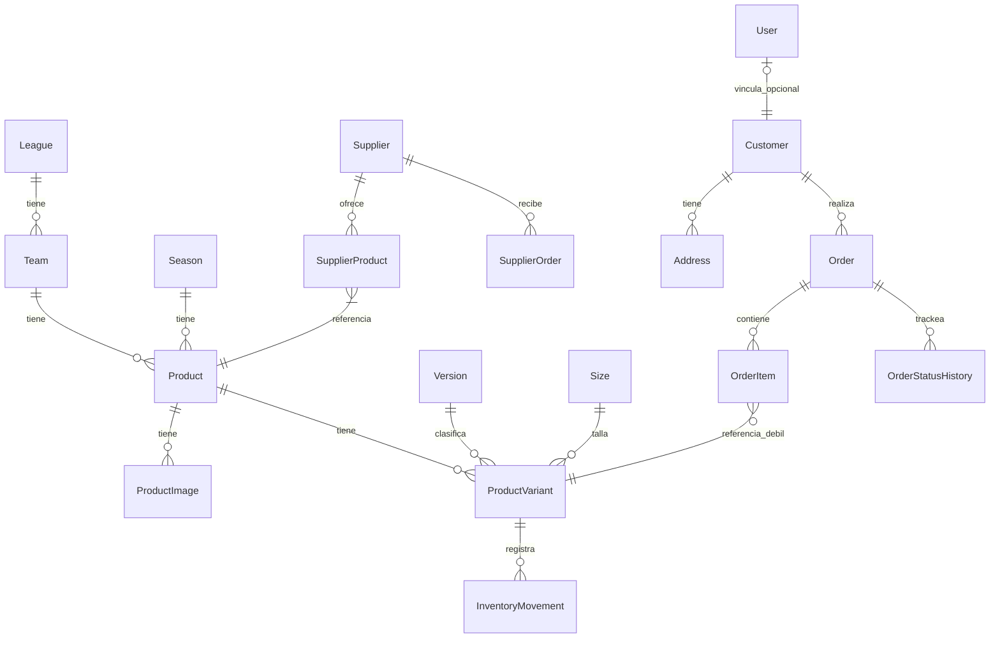

# Football Jersey Store — Arquitectura de Dominio (DDD)

> Versión consolidada MVP — Julio 2026
> 20 entidades · 7 bounded contexts · 6 aggregate roots · 8 enums

---

## Índice

1. [Bounded Contexts](#1-bounded-contexts)
2. [Aggregate Roots](#2-aggregate-roots)
3. [Diagrama ERD](#3-diagrama-erd)
4. [Catálogo de Entidades](#4-catalogo-de-entidades)
5. [Matriz de Relaciones](#5-matriz-de-relaciones)
6. [Prisma Schema](#6-prisma-schema)
7. [Principios de Diseño](#7-principios-de-diseno)

---

## 1. Bounded Contexts

```
┌────────────────────────────────────────────────────────────┐
│                     FOOTBALL JERSEY STORE                   │
│                                                            │
│  ┌───────────┐  ┌───────────┐  ┌───────────┐               │
│  │ CATALOG   │  │ INVENTORY │  │ SUPPLIER  │               │
│  │           │  │           │  │           │               │
│  │ Product   │  │ Movement  │  │ Supplier  │               │
│  │ Variant   │  │           │  │ SupplierP │               │
│  │ League/   │  │ (sin FK a │  │ SupplierO │               │
│  │ Team/Sea  │  │  Order)   │  │           │               │
│  └───────────┘  └───────────┘  └───────────┘               │
│                                                            │
│  ┌───────────┐  ┌───────────┐  ┌───────────┐               │
│  │ CUSTOMER  │  │ ORDER     │  │ USER&     │               │
│  │           │  │           │  │ AUTH      │               │
│  │ Customer  │  │ Order     │  │           │               │
│  │ Address   │  │ OrderItem │  │ User      │               │
│  │           │  │ Status    │  │           │               │
│  └───────────┘  └───────────┘  └───────────┘               │
│                                                            │
│  ┌───────────┐                                             │
│  │ SYSTEM    │                                             │
│  │           │                                             │
│  │ Setting   │                                             │
│  └───────────┘                                             │
└────────────────────────────────────────────────────────────┘
```

---

## 2. Aggregate Roots

| Agregado | Root | Entidades hijas | Invariantes |
|---|---|---|---|
| **Product** | `Product` | ProductImage, ProductVariant | SKU único por product+version+size. Al menos una imagen primaria. costPrice < salePrice |
| **Customer** | `Customer` | Address | Máximo una dirección por defecto. Email único si es cliente registrado |
| **Order** | `Order` | OrderItem, OrderStatusHistory | total = subtotal + personalizationFee + shippingFee - discountAmount. Las transiciones de estado deben seguir el lifecycle definido |
| **Supplier** | `Supplier` | SupplierProduct | Un mismo producto no puede tener dos registros para el mismo proveedor |
| **SupplierOrder** | `SupplierOrder` | SupplierOrderItem | totalCost = SUM(unitCost × quantity) de sus items |
| **User** | `User` | — | Email único. Un User puede tener 0 o 1 Customer vinculado |

### Entidades standalone (no pertenecen a un agregado)

| Entidad | Contexto | Motivo |
|---|---|---|
| League, Team, Season, Version, Size | Catalog | Son tablas de referencia/lookup. No tienen hijos ni invariantes complejas |
| InventoryMovement | Inventory | Es un registro histórico inmutable. No es raíz de agregado porque siempre se consulta en función de ProductVariant |
| Setting | System | Par clave-valor simple |

---

## 3. Diagrama ERD



---

## 4. Catálogo de Entidades

### Catalog (6 entidades + 3 hijas + 1 lookup)

| # | Entidad | Tipo | Descripción |
|---|---|---|---|
| 1 | **League** | Lookup | Liga/competición |
| 2 | **Team** | Lookup | Equipo |
| 3 | **Season** | Lookup | Temporada |
| 4 | **Version** | Lookup | Versión de camiseta (Fan, Player, Retro, Training) |
| 5 | **Size** | Lookup | Talla |
| 6 | **Product** | Aggregate Root | Producto base |
| 7 | **ProductImage** | Entity child | Imagen del producto (heredero de Product) |
| 8 | **ProductVariant** | Entity child | SKU individual (heredero de Product) |
| 9 | *Brand* | 🔜 V2 | Hoy es `brand: String?` en Product |

### Inventory (1 entidad)

| # | Entidad | Tipo | Descripción |
|---|---|---|---|
| 10 | **InventoryMovement** | Entity (histórico) | Movimiento de inventario. Fuente de verdad del stock |
| 11 | *StockReservation* | ❌ Eliminado | Redundante con MovementType.RESERVATION |

### Supplier (4 entidades)

| # | Entidad | Tipo | Descripción |
|---|---|---|---|
| 12 | **Supplier** | Aggregate Root | Proveedor |
| 13 | **SupplierProduct** | Entity child | Precio por producto-proveedor |
| 14 | **SupplierOrder** | Aggregate Root | Pedido al proveedor |
| 15 | **SupplierOrderItem** | Entity child | Item del pedido al proveedor |

### Customer (2 entidades)

| # | Entidad | Tipo | Descripción |
|---|---|---|---|
| 16 | **Customer** | Aggregate Root | Cliente (existe sin User, guest checkout) |
| 17 | **Address** | Entity child | Dirección de envío |

### User & Auth (1 entidad)

| # | Entidad | Tipo | Descripción |
|---|---|---|---|
| 18 | **User** | Aggregate Root | Cuenta autenticada |

### Order (3 entidades)

| # | Entidad | Tipo | Descripción |
|---|---|---|---|
| 19 | **Order** | Aggregate Root | Pedido |
| 20 | **OrderItem** | Entity child | Item del pedido (snapshot + personalización) |
| 21 | **OrderStatusHistory** | Entity child | Log de transiciones de estado |

### System (1 entidad)

| # | Entidad | Tipo | Descripción |
|---|---|---|---|
| 22 | **Setting** | VO | Configuración clave-valor |

> **Total: 20 entidades + 2 documentadas como V2/eliminadas**

### Entidades movidas a V2

| Entidad | Motivo |
|---|---|
| Brand → `brand: String?` en Product | 3 marcas en seed no justifican tabla + CRUD admin. Promover a entidad cuando haya >20 |
| Collection + ProductCollection | Sin casos de uso reales en MVP. Las agrupaciones se manejan por liga/equipo/temporada |
| Promotion + PromotionProduct + PromotionCollection | Sin lógica de descuento implementada. Aplazar hasta que haya campañas reales |
| Coupon | Sin lógica de descuento implementada. Aplazar |
| ShippingMethod | El envío en MVP se maneja con `shippingMethod: String` en Order + lógica hardcodeada |
| StockReservation | Eliminado. MovementType.RESERVATION cubre el mismo concepto |

---

## 5. Matriz de Relaciones

### Relaciones con FK en base de datos

| Desde | Hacia | Cardinalidad | Comportamiento |
|---|---|---|---|
| Team | League | N:1 | Obligatoria |
| Product | Team | N:1 | Obligatoria |
| Product | Season | N:1 | Obligatoria |
| ProductImage | Product | N:1 | Cascade delete |
| ProductVariant | Product | N:1 | Cascade delete |
| ProductVariant | Version | N:1 | Restrict (no cascade) |
| ProductVariant | Size | N:1 | Restrict (no cascade) |
| SupplierProduct | Supplier | N:1 | Cascade delete |
| SupplierProduct | Product | N:1 | Cascade delete |
| SupplierOrder | Supplier | N:1 | Restrict (no cascade) |
| SupplierOrderItem | SupplierOrder | N:1 | Cascade delete |
| Address | Customer | N:1 | Cascade delete |
| Customer | User | 1:1 | Opcional (nullable) |
| Order | Customer | N:1 | Opcional (nullable, guest) |
| OrderItem | Order | N:1 | Restrict (sin cascade) |
| OrderStatusHistory | Order | N:1 | Restrict (sin cascade) |

### Relaciones débiles (sin FK, referencias por string)

| Desde | Hacia | Tipo | Motivo |
|---|---|---|---|
| InventoryMovement | Order | `orderReference: String?` | Cross-context. No debe haber FK entre Inventory y Order |
| InventoryMovement | User | `userReference: String?` | Cross-context. No debe haber FK entre Inventory y Auth |
| OrderItem | Product | `productId: String?` | Referencia débil (snapshot) |
| OrderItem | ProductVariant | `variantId: String?` | Referencia débil (snapshot) |

### Relaciones eliminadas del diseño anterior

| Relación | Motivo de eliminación |
|---|---|
| Product → OrderItem (bidireccional) | Cross-context: Catalog no debe navegar a Order |
| Product → SupplierProduct (bidireccional) | Cross-context: Catalog no necesita navegar a Supplier |
| Product → PromotionProduct | Promotion eliminado del MVP |
| Product → ProductCollection | Collection eliminado del MVP |
| Order → InventoryMovement (bidireccional) | Cross-context. Ahora es referencia débil por string |
| Order → StockReservation | StockReservation eliminado |
| Order → Coupon | Coupon eliminado del MVP |
| Order → ShippingMethod (FK) | ShippingMethod eliminado del MVP |

---

## 6. Prisma Schema

Ver `prisma/schema.prisma` — 20 entidades, 8 enums, ~310 líneas.

---

## 7. Principios de Diseño

### 7.1 Correcciones aplicadas desde la revisión crítica

| Hallazgo | Severidad | Corrección aplicada |
|---|---|---|
| C-1: quantity firmado + type redundante | Crítico | `quantity` ahora SIEMPRE positivo. Dirección solo por `MovementType` |
| C-2: availability como columna derivada | Crítico | Eliminada del schema. Se computa en la app |
| C-3: FK cross-context Inventory→Order/User | Crítico | Reemplazadas por `orderReference` y `userReference` (strings, sin FK) |
| C-4: Cascade delete en movimientos | Crítico | Eliminado. InventoryMovement sin FK a ProductVariant |
| H-1: StockReservation redundante | Alto | Eliminado. Usar MovementType.RESERVATION |
| H-2: Product.basePrice huérfano | Alto | Eliminado |
| H-3: Promotion.scope redundante | Alto | Promotion eliminado del MVP |
| H-4: Cascade en Order→OrderItem/History | Alto | Reemplazado por Restrict (sin cascade) |
| H-5: Product→OrderItem bidireccional | Alto | Relación eliminida. Solo OrderItem→Product |
| H-6: sourceType como String | Alto | Convertido a enum `SourceType` |
| H-7: paymentMethod como String | Alto | Convertido a enum `PaymentMethod` |
| H-8: Sobreingeniería (Brand, Collection, Promotion, Coupon, ShippingMethod) | Alto | Movido a V2 |
| M-1: Version.surcharge renaming | Medio | Renombrado a `priceAdjustment` |
| M-4: kitType como String | Medio | Convertido a enum `KitType` |
| M-5: User.role como String | Medio | Convertido a enum `UserRole` |

### 7.2 Decisión sobre cascade delete

| Relación | Comportamiento | Razón |
|---|---|---|
| Product → ProductImage | Cascade | Imágenes sin producto no tienen sentido |
| Product → ProductVariant | Cascade | Variantes sin producto no tienen sentido |
| Order → OrderItem | Restrict | Nunca eliminar items de un pedido real |
| Order → OrderStatusHistory | Restrict | Nunca eliminar historial de cambios |
| ProductVariant → InventoryMovement | Sin FK | Eliminar cascade que destruye auditoría |
| Customer → Address | Cascade | Direcciones sin cliente no tienen sentido |

### 7.3 Estrategia de inventario

El stock actual de una variante se calcula como:

```sql
SELECT SUM(
  CASE
    WHEN type IN ('IN', 'RETURN', 'CANCELLATION') THEN quantity
    WHEN type IN ('OUT', 'SALE', 'RESERVATION') THEN -quantity
    WHEN type = 'ADJUSTMENT' AND adjustmentDirection = 'INCREMENT' THEN quantity
    WHEN type = 'ADJUSTMENT' AND adjustmentDirection = 'DECREMENT' THEN -quantity
  END
) FROM InventoryMovement WHERE variantId = ?;
```

### 7.4 Estrategia de disponibilidad

`availability` no se almacena. Se computa en la aplicación:

```
if stock > lowStockAt → AVAILABLE
if stock <= 0 AND supplierHasProduct → ON_DEMAND
if stock <= 0 AND NOT supplierHasProduct → OUT_OF_STOCK
if product release date in future → COMING_SOON
```

### 7.5 Precios

- `costPrice`: lo que paga la tienda al proveedor (costo real)
- `salePrice`: precio de venta actual
- `compareAtPrice`: precio de referencia para mostrar tachado ("antes $X")
- `priceAdjustment` en Version: ayuda a calcular el precio sugerido al crear variantes

Los tres valores están en centavos COP (Int). No hay moneda por variante — la moneda es COP para toda la tienda en MVP.

### 7.6 Crecimiento futuro sin romper el dominio

| Funcionalidad futura | Cómo se agrega sin breaking changes |
|---|---|
| Brand como entidad | `brand: String?` → `brandId: String?` FK a nueva tabla Brand. Migración de datos: crear Brand desde strings existentes |
| Collection/ProductCollection | Agregar entidades nuevas. Products existentes pueden asignarse después |
| Promotion + Coupon | Agregar entidades nuevas. Order ya tiene `discountAmount` preparado |
| ShippingMethod como entidad | Agregar entidad. `shippingMethod: String` en Order es compatible |
| Múltiples monedas | Agregar `currency: String` a Order (setup para reporting). Tienda sigue en COP |
| Precios con IVA | Agregar `taxAmount` y `taxRate` a Order. `total` existente se puede desglosar |

---

## 8. Roadmap de implementación

### Fase 1 — MVP (ahora)

- Schema completo con 20 entidades
- Catalog: Product, ProductImage, ProductVariant, League, Team, Season, Version, Size
- Inventory: InventoryMovement
- Supplier: Supplier, SupplierProduct, SupplierOrder, SupplierOrderItem
- Customer: Customer, Address
- Auth: User (mínimo, sin login aún)
- Order: Order, OrderItem, OrderStatusHistory
- System: Setting

### Fase 2 — Próximo sprint

- Integración con pasarela de pago real
- NextAuth + login
- ShippingMethod como entidad (si hay múltiples carriers)
- Panel admin con gestión de inventario (CRUD movimientos)

### Fase 3 — V2

- Brand como entidad
- Collection + ProductCollection
- Promotion + Coupon
- Reportes financieros con taxAmount/taxRate

---

> **Documento generado: Julio 2026**

## 9. Notificaciones de pedidos

`src/features/notifications` es un bounded context server-only. El servicio construye el evento desde los snapshots de `Order` y `OrderItem`, lo formatea y lo entrega mediante el puerto `NotificationTransport`; Telegram es el adaptador actual y recibe sus credenciales únicamente desde variables de entorno.

`NotificationAttempt` pertenece al agregado operativo de notificaciones y se relaciona con `Order` con `Restrict`. Su `idempotencyKey` única se deriva de `orderId`, `TELEGRAM` y `ORDER_CREATED_PAID`. El claim condicional evita reclamar dos veces un intento y los estados `FAILED`/`NOT_CONFIGURED` son reintentables; `SENT` es terminal.

El aviso se dispara después de confirmar el pago y crear el pedido. Es un efecto secundario no bloqueante: una indisponibilidad de Telegram nunca revierte ni modifica el pedido, sus importes, sus líneas, sus snapshots de modalidad o el inventario. La proyección administrativa normaliza snapshots ausentes como `NO_DISPONIBLE` y filtra modalidades de forma inclusiva.
