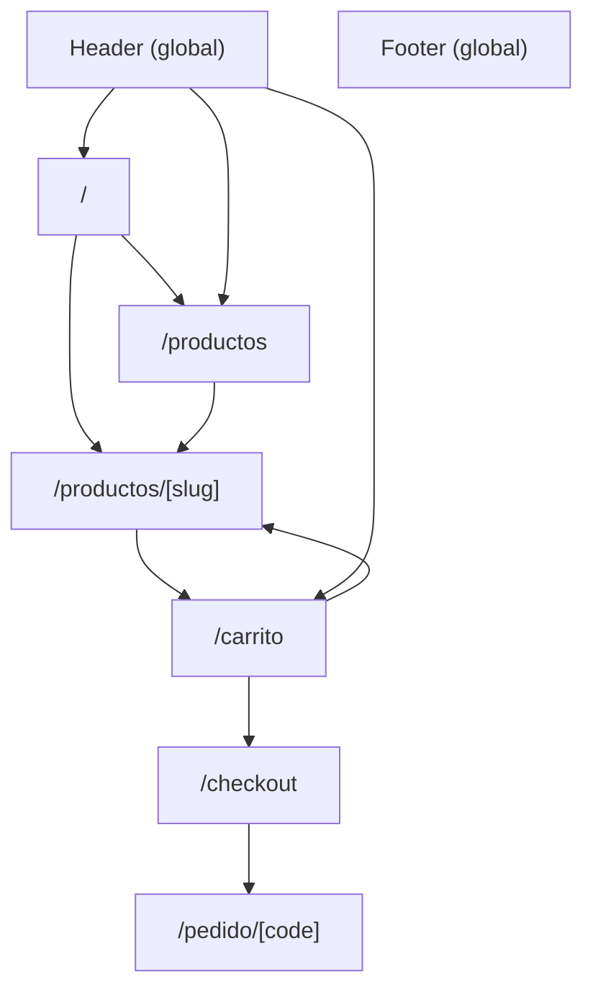
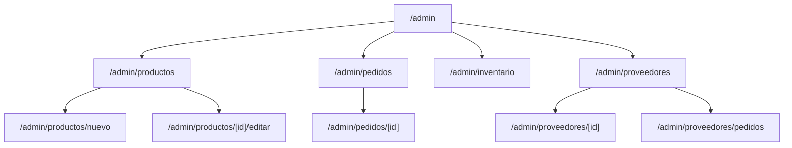
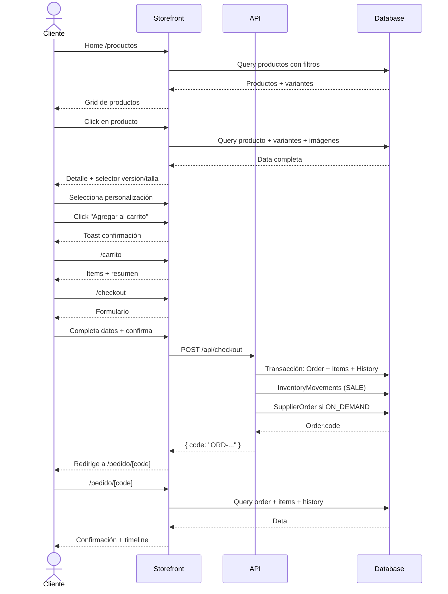
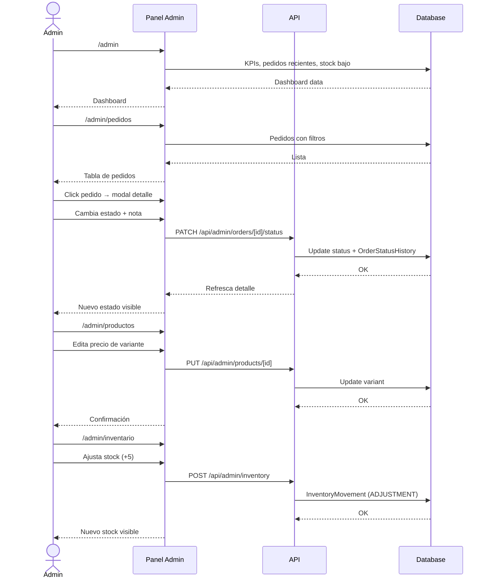

# Football Jersey Store — Diseño de UX (Sprint -1)

> **Propósito:** Definir estructura, navegación e interacciones del MVP.
> No es un diseño visual. Es un blueprint para construir.

---

## 1. Mapa de navegación

### Navegación cliente (storefront)



### Navegación administrador



---

## 2. Pantallas del cliente (storefront)

### 2.1 Home — `/`

```
┌──────────────────────────────────────────────────────────────┐
│ [Logo]  Inicio  Catálogo  [Search]  [Carrito: 2]             │ ← Header
├──────────────────────────────────────────────────────────────┤
│                                                              │
│  ┌────────────────────────────────────────────────────────┐  │
│  │                                                        │  │
│  │       ⚽ CAMISETAS ORIGINALES                           │  │
│  │       Envío gratis desde $200.000                       │  │
│  │       [Ver catálogo →]                                  │  │
│  │                                                        │  │
│  └────────────────────────────────────────────────────────┘  │
│                       ↑ Hero section                          │
│                                                              │
│  ┌──────────┐ ┌──────────┐ ┌──────────┐ ┌──────────┐        │
│  │ 🚚 Envío │ │ ✅ Pagos │ │ 🔄 Cambios│ │ ⭐ Original│       │
│  │ rápido   │ │ seguros  │ │ gratis   │ │ garantizado│       │
│  └──────────┘ └──────────┘ └──────────┘ └──────────┘        │
│                       ↑ Trust bar                             │
│                                                              │
│  ┌────────────────────────────────────────────────────────┐  │
│  │  Ligas destacadas      [Ver todas →]                   │  │
│  │                                                        │  │
│  │  [🏴 Inglaterra]  [🇪🇸 España]  [🇮🇹 Italia]  [🇩🇪 Alemania]│  │
│  └────────────────────────────────────────────────────────┘  │
│                       ↑ League chips                          │
│                                                              │
│  ┌────────────────────────────────────────────────────────┐  │
│  │  Productos destacados    [Ver todos →]                  │  │
│  │                                                        │  │
│  │  ┌──────┐ ┌──────┐ ┌──────┐ ┌──────┐                  │  │
│  │  │ Img  │ │ Img  │ │ Img  │ │ Img  │                  │  │
│  │  │ R.Madrid│ │Barcelona│ │Liverpool│ │City   │         │  │
│  │  │ $89.900│ │ $89.900│ │$94.900│ │$89.900│         │  │
│  │  │ [Disponible] │ [Agotado] │[Bajo pedido]│[Disponible]│  │
│  │  └──────┘ └──────┘ └──────┘ └──────┘                  │  │
│  └────────────────────────────────────────────────────────┘  │
│                       ↑ Featured products grid (4-8)          │
│                                                              │
│  ┌────────────────────────────────────────────────────────┐  │
│  │  ¿Necesitas ayuda?  📱 WhatsApp +57 300 123 4567       │  │
│  └────────────────────────────────────────────────────────┘  │
│                       ↑ CTA WhatsApp                         │
├──────────────────────────────────────────────────────────────┤
│ [Logo]  © 2026 Football Jersey Store · Términos · Privacidad │ ← Footer
└──────────────────────────────────────────────────────────────┘
```

**Interacciones:**
- Hero CTA → `/productos`
- League chip → `/productos?liga=premier`
- Product card → `/productos/[slug]`
- Cart badge en header → `/carrito`

---

### 2.2 Catálogo — `/productos`

```
┌──────────────────────────────────────────────────────────────┐
│ [Logo]  Inicio > Catálogo                     [Carrito: 2]   │ ← Breadcrumb + Header
├──────────────────────────────────────────────────────────────┤
│                                                              │
│  ┌──────────────┐  ┌────────────────────────────────────┐   │
│  │  FILTROS     │  │  Ordenar por: [Más populares ▼]    │   │
│  │              │  │  [🎮 24 productos]                  │   │
│  │ 🔍 Buscar    │  │                                    │   │
│  │ [.........]  │  │  ┌──────┐ ┌──────┐ ┌──────┐       │   │
│  │              │  │  │ Img  │ │ Img  │ │ Img  │       │   │
│  │ Liga         │  │  │ Real │ │ Barsa│ │ City │       │   │
│  │ [Premier][LaLiga][SerieA]│ │$89.9K│ │$89.9K│ │$94.9K│       │   │
│  │ [Bundes][Ligue1]│  │[Dispo]│ │[Agot]│ │[Pedido]│       │   │
│  │              │  │  └──────┘ └──────┘ └──────┘       │   │
│  │ Equipo       │  │  ┌──────┐ ┌──────┐ ┌──────┐       │   │
│  │ [Seleccionar▼]│  │  │ Img  │ │ Img  │ │ Img  │       │   │
│  │              │  │  │ ...  │ │ ...  │ │ ...  │       │   │
│  │ Temporada    │  │  └──────┘ └──────┘ └──────┘       │   │
│  │ [25/26] [24/25]│  │                                    │   │
│  │              │  │  [← 1 2 3 4 →]  ← Pagination        │   │
│  │ Versión      │  └────────────────────────────────────┘   │
│  │ [Fan][Player][Retro]│                                      │
│  │              │                                            │
│  │ Talla        │                                            │
│  │ [S][M][L][XL]│                                            │
│  │              │                                            │
│  │ Disponibilidad│                                           │
│  │ [Disponible][Bajo pedido]│                                │
│  └──────────────┘                                            │
├──────────────────────────────────────────────────────────────┤
│ Footer                                                       │
└──────────────────────────────────────────────────────────────┘
```

**Interacciones:**
- Los filtros se aplican vía query params (SSR): `?liga=premier&talla=M&version=player`
- Cada cambio de filtro recarga la página (Server Component)
- Los chips de liga/temporada/versión se pueden deseleccionar (toggle)
- Product card → `/productos/[slug]`

---

### 2.3 Detalle de producto — `/productos/[slug]`

```
┌──────────────────────────────────────────────────────────────┐
│ Inicio > Catálogo > Real Madrid 2025/26 Local                │ ← Breadcrumb
├──────────────────────────────────────────────────────────────┤
│                                                              │
│  ┌──────────────────┐  ┌────────────────────────────────┐    │
│  │                  │  │  Real Madrid 2025/26            │    │
│  │   [Imagen       │  │  Adidas · La Liga · Temporada   │    │
│  │    principal]   │  │                                 │    │
│  │                  │  │  ⭐⭐⭐⭐⭐ (12 reseñas)          │    │
│  │                  │  │                                 │    │
│  │  [img2][img3]    │  │  $89.900                        │    │
│  │                  │  │  ~~$120.000~~  [−25%]  ← compareAt│  │
│  │                  │  │                                 │    │
│  └──────────────────┘  │  Versión                         │    │
│                         │  [● Fan] [○ Player] [○ Retro]   │    │
│                         │                                 │    │
│                         │  Talla                          │    │
│                         │  [S] [M] [● L] [XL] [XXL]      │    │
│                         │                                 │    │
│                         │  Personalización                │    │
│                         │  [○ Sin personalizar]           │    │
│                         │  [● Personalizar]  → muestra:   │    │
│                         │    Nombre: [Vinicius_______]    │    │
│                         │    Número: [7_________________] │    │
│                         │  [○ Jugador oficial] → select:  │    │
│                         │    [Vinicius Jr. - 7 ▼]         │    │
│                         │                                 │    │
│                         │  [       Agregar al carrito  ]  │    │
│                         │  [     $89.900 · ¡Disponible!]  │    │
│                         │                                 │    │
│                         │  [🏷️ Stock disponible]          │    │
│                         │  [🚚 Envío gratis > $200.000]   │    │
│                         │  [🔄 Cambios gratis 30 días]    │    │
│                         └────────────────────────────────┘    │
│                                                              │
│  ┌────────────────────────────────────────────────────────┐  │
│  │  Productos relacionados                                │  │
│  │  ┌──────┐ ┌──────┐ ┌──────┐ ┌──────┐                 │  │
│  │  │ Img  │ │ Img  │ │ Img  │ │ Img  │                 │  │
│  │  └──────┘ └──────┘ └──────┘ └──────┘                 │  │
│  └────────────────────────────────────────────────────────┘  │
├──────────────────────────────────────────────────────────────┤
│ Footer                                                       │
└──────────────────────────────────────────────────────────────┘
```

**Interacciones:**
- Galería: click en thumbnail cambia imagen principal (Client Component)
- Versión y talla: botones de selección exclusiva (radio group)
- Personalización: toggle entre NONE / CUSTOM / OFFICIAL_PLAYER
- Al cambiar versión: se actualiza precio, disponibilidad y stock mostrado
- "Agregar al carrito": crea item con todas las opciones seleccionadas + toast de confirmación
- Si está agotado: botón deshabilitado + "Notificarme cuando esté disponible"

---

### 2.4 Carrito — `/carrito`

```
┌──────────────────────────────────────────────────────────────┐
│ [Logo]  Inicio > Carrito                      [Carrito: 2]   │
├──────────────────────────────────────────────────────────────┤
│                                                              │
│  Tu carrito (2 productos)                                    │
│                                                              │
│  ┌────────────────────────────────────────────────────────┐  │
│  │ [Img]  Real Madrid 25/26 · Player · Talla L           │  │
│  │        Vinicius Jr. - 7                                │  │
│  │        $149.900  [−]  1  [+]  [🗑️]                    │  │
│  └────────────────────────────────────────────────────────┘  │
│                                                              │
│  ┌────────────────────────────────────────────────────────┐  │
│  │ [Img]  Liverpool 25/26 · Fan · Talla M                 │  │
│  │        Sin personalizar                                │  │
│  │        $89.900   [−]  2  [+]  [🗑️]                     │  │
│  └────────────────────────────────────────────────────────┘  │
│                                                              │
│  ┌────────────────────────────────────────────────────────┐  │
│  │  Resumen                                               │  │
│  │                                                        │  │
│  │  Subtotal (3 productos)          $329.700              │  │
│  │  Personalización                  $10.000              │  │
│  │  Envío                           $0 (gratis)           │  │
│  │  ─────────────────────────────────────                 │  │
│  │  Total                            $339.700             │  │
│  │                                                        │  │
│  │  [     Ir a pagar →     ]                              │  │
│  │                                                        │  │
│  │  🛡️ Pago seguro · No guardamos tu tarjeta             │  │
│  └────────────────────────────────────────────────────────┘  │
│                                                              │
│  [Seguir comprando →]                                        │
├──────────────────────────────────────────────────────────────┤
│ Footer                                                       │
└──────────────────────────────────────────────────────────────┘
```

**Interacciones:**
- [+]/[−]: actualiza cantidad. Si llega a 0, muestra confirmación antes de eliminar
- [🗑️]: elimina item sin confirmación (undo via toast por 5s)
- "Ir a pagar": valida carrito no vacío → `/checkout`
- Precios y envío se recalculan en tiempo real (Client Component, Zustand)

---

### 2.5 Checkout — `/checkout`

```
┌──────────────────────────────────────────────────────────────┐
│ [Logo]  Inicio > Carrito > Checkout                          │
├──────────────────────────────────────────────────────────────┤
│                                                              │
│  ┌────────────────────┐  ┌────────────────────────────┐      │
│  │  Información de    │  │  Resumen del pedido        │      │
│  │  contacto          │  │                            │      │
│  │                    │  │  (3) productos              │      │
│  │  Nombre completo   │  │  R.Madrid Player L x1      │      │
│  │  [_______________]│  │  Liverpool Fan M x2        │      │
│  │                    │  │                            │      │
│  │  Correo electrónico│  │  Subtotal    $329.700      │      │
│  │  [_______________]│  │  Personaliz. $10.000       │      │
│  │                    │  │  Envío       $0            │      │
│  │  Teléfono          │  │  ─────────────────        │      │
│  │  [_______________]│  │  Total       $339.700      │      │
│  │                    │  │                            │      │
│  │  Dirección de      │  └────────────────────────────┘      │
│  │  envío             │                                      │
│  │                    │                                      │
│  │  Dirección         │                                      │
│  │  [_______________]│                                      │
│  │                    │                                      │
│  │  Ciudad            │                                      │
│  │  [_______________]│                                      │
│  │                    │                                      │
│  │  Departamento      │                                      │
│  │  [_______________]│                                      │
│  │                    │                                      │
│  │  Método de pago    │                                      │
│  │                    │                                      │
│  │  [●] Tarjeta       │                                      │
│  │  [○] PSE           │                                      │
│  │  [○] Nequi         │                                      │
│  │  [○] Daviplata     │                                      │
│  │                    │                                      │
│  │  [  Confirmar pedido  ]                                   │
│  │                    │                                      │
│  │  Al confirmar aceptas términos y condiciones              │
│  └────────────────────┘                                      │
├──────────────────────────────────────────────────────────────┤
│ Footer                                                       │
└──────────────────────────────────────────────────────────────┘
```

**Interacciones:**
- Formulario del lado cliente con validación en tiempo real
- Al cambiar método de pago: no cambia nada visualmente (mock)
- "Confirmar pedido": POST a `/api/checkout` → loading state → redirige a `/pedido/[code]`
- Si hay error de stock: toast con mensaje + item marcado en rojo

---

### 2.6 Confirmación de pedido — `/pedido/[code]`

```
┌──────────────────────────────────────────────────────────────┐
│ [Logo]                                                       │
├──────────────────────────────────────────────────────────────┤
│                                                              │
│  ✅  ¡Pedido confirmado!                                     │
│                                                              │
│  Código: ORD-20260714-ABCD                                  │
│                                                              │
│  Te hemos enviado un resumen a tu correo.                    │
│                                                              │
│  ┌────────────────────────────────────────────────────────┐  │
│  │  Timeline del pedido                                   │  │
│  │                                                        │  │
│  │  ✅ Pendiente de pago        — 14 jul, 3:45 PM         │  │
│  │  ⏳ Pagado                   — procesando...            │  │
│  │  ☐ Validando                                           │  │
│  │  ☐ En preparación                                      │  │
│  │  ☐ Enviado                                             │  │
│  │  ☐ Entregado                                           │  │
│  └────────────────────────────────────────────────────────┘  │
│                                                              │
│  ┌────────────────────────────────────────────────────────┐  │
│  │  Detalle del pedido                                    │  │
│  │                                                        │  │
│  │  Real Madrid 25/26 · Player · Talla L   $149.900      │  │
│  │    Vinicius Jr. - 7 · Envío: Local                    │  │
│  │                                                        │  │
│  │  Liverpool 25/26 · Fan · Talla M x2     $179.800      │  │
│  │    Sin personalizar · Envío: Proveedor (15-20 días)   │  │
│  │                                                        │  │
│  │  Total pagado: $339.700                                │  │
│  └────────────────────────────────────────────────────────┘  │
│                                                              │
│  [Seguir comprando]                                          │
├──────────────────────────────────────────────────────────────┤
│ Footer                                                       │
└──────────────────────────────────────────────────────────────┘
```

**Interacciones:**
- URL compartible: cualquiera con el código puede ver el estado del pedido
- Timeline se actualiza con cada cambio de estado
- "Seguir comprando" → Home

---

## 3. Pantallas del administrador

### 3.1 Layout admin (sidebar)

```
┌──────────────────────────────────────────────────────────────┐
│  ┌──────────┐  ┌─────────────────────────────────────────┐  │
│  │ Logo     │  │  [Breadcrumbs]            👤 Admin      │  │
│  │          │  │                                          │  │
│  │ 📊 Dash  │  │                                          │  │
│  │ 👕 Prod. │  │  (Contenido de la página)                │  │
│  │ 📦 Ped.  │  │                                          │  │
│  │ 📈 Invent│  │                                          │  │
│  │ 🏭 Prov. │  │                                          │  │
│  │          │  │                                          │  │
│  └──────────┘  └─────────────────────────────────────────┘  │
└──────────────────────────────────────────────────────────────┘
```

---

### 3.2 Dashboard admin — `/admin`

```
┌──────────────────────────────────────────────────────────────┐
│  Sidebar │  Dashboard                                        │
│          │                                                   │
│          │  ┌──────────┐ ┌──────────┐ ┌──────────┐ ┌──────┐ │
│          │  │ $2,459K  │ │   45     │ │   120    │ │ 340  │ │
│          │  │ Ingresos │ │ Pedidos  │ │ Variantes│ │ Clien│ │
│          │  │ este mes │ │ activos  │ │ con stock│ │      │ │
│          │  └──────────┘ └──────────┘ └──────────┘ └──────┘ │
│          │                                                   │
│          │  Pedidos recientes                                │
│          │  ┌────────────────────────────────────────────┐   │
│          │  │ Código   | Cliente    | Total   | Estado   │   │
│          │  │ ORD-001  | Juan Pérez | $89.900 | ✅ Pagado│   │
│          │  │ ORD-002  | Ana Gómez  |$149.900 | 🚚 Env. │   │
│          │  │ ORD-003  | Carlos Pez |$239.700 | ⏳ Pend. │   │
│          │  └────────────────────────────────────────────┘   │
│          │                                                   │
│          │  Stock bajo                                       │
│          │  • Real Madrid 25/26 Player L — 2 unidades       │
│          │  • Liverpool 25/26 Fan XL — 1 unidad             │
│          └───────────────────────────────────────────────────┘
```

---

### 3.3 Gestión de pedidos — `/admin/pedidos`

```
┌──────────────────────────────────────────────────────────────┐
│  Sidebar │  Pedidos                                          │
│          │                                                   │
│          │  [Buscar código...]  [Filtrar por estado ▼]       │
│          │                                                   │
│          │  ┌────────────────────────────────────────────┐   │
│          │  │ Código   | Cliente     | Total    | Estado   │   │
│          │  │──────────────────────────────────────────── │   │
│          │  │ ORD-001  | Juan Pérez   | $89.900 | Pagado  │   │
│          │  │ ORD-002  | Ana Gómez    |$149.900 | Enviado │   │
│          │  │ ORD-003  | Carlos Pez   |$239.700 | Pend.   │   │
│          │  └────────────────────────────────────────────┘   │
│          │                                                   │
│          │  [← 1 2 3 4 →]                                   │
│          └───────────────────────────────────────────────────┘
│                                                                
│  Click en una fila → modal con detalle del pedido:            
│  ┌────────────────────────────────────────────────────────┐   
│  │  Pedido ORD-001                                       │   
│  │                                                        │   
│  │  Cliente: Juan Pérez · juan@email.com · 3001234567    │   
│  │  Dirección: Cra 10 #20-30, Bogotá, Colombia           │   
│  │                                                        │   
│  │  Productos:                                           │   
│  │  • Real Madrid 26/27 Player L x1 — $89.900           │   
│  │    Personalización: Vinicius Jr. - 7                  │   
│  │                                                        │   
│  │  Total: $89.900 · Pagado: 14 jul 2026, 3:45 PM       │   
│  │                                                        │   
│  │  Estado actual: ✅ Pagado                              │   
│  │  Nuevo estado: [Validar ▼]                            │   
│  │  Nota: [________________]  [Actualizar]               │   
│  │                                                        │   
│  │  Historial:                                            │   
│  │  • 14 jul 3:45 PM — Pendiente → Pagado (sistema)     │   
│  │  • 14 jul 3:40 PM — Creado (sistema)                 │   
│  └────────────────────────────────────────────────────────┘   
```

**Interacciones:**
- Tabla paginada con filtros por estado y búsqueda por código
- Click en fila abre modal/detalle
- En el detalle: selector de nuevo estado + nota + botón actualizar
- El cambio de estado se refleja en el timeline del cliente

---

### 3.4 Gestión de productos — `/admin/productos`

```
┌──────────────────────────────────────────────────────────────┐
│  Sidebar │  Productos                     [+ Nuevo producto] │
│          │                                                   │
│  ┌──────┬──────────┬────────┬────────┬───────┬────────────┐ │
│  │ Img  │ Nombre   │ Equipo │ Precio │ Stock │ Estado     │ │
│  ├──────┼──────────┼────────┼────────┼───────┼────────────┤ │
│  │ [img]│Real Madrid│ RM FC  │ $89.9K │ 12    │ ✅ Activo │ │
│  │ [img]│Barcelona │ FCB    │ $89.9K │ 0     │ ❌ Inact. │ │
│  │ [img]│Liverpool │ LFC    │ $94.9K │ 3     │ ✅ Activo │ │
│  └──────┴──────────┴────────┴────────┴───────┴────────────┘ │
│                                                              │
│  Click en producto → modal de edición:                       │
│  ┌────────────────────────────────────────────────────────┐  │
│  │  Editar: Real Madrid 2025/26 Local                     │  │
│  │                                                        │  │
│  │  Nombre: [Real Madrid 2025/26 Local___________]        │  │
│  │  Slug: [real-madrid-2025-26-local]                     │  │
│  │  Equipo: [Real Madrid ▼]   Temp: [2025/26 ▼]           │  │
│  │  Kit: [Local ▼]   Marca: [Adidas]                     │  │
│  │  Precio base: $89.900   Activo: [✅]                   │  │
│  │                                                        │  │
│  │  Imágenes: [Añadir imágenes]                           │  │
│  │  [img1] [img2] [img3] (arrastrar para ordenar)        │  │
│  │                                                        │  │
│  │  Variantes:   [Añadir variante]                       │  │
│  │  ┌────────┬──────┬─────────┬─────────┬──────┐         │  │
│  │  │Versión │ Talla│ Costo   │ Venta   │Stock │         │  │
│  │  │ Fan    │ M    │ $45,000 │ $89,900 │  12  │         │  │
│  │  │ Player │ M    │ $65,000 │$129,900 │  5   │         │  │
│  │  │ Fan    │ L    │ $45,000 │ $89,900 │  0   │         │  │
│  │  └────────┴──────┴─────────┴─────────┴──────┘         │  │
│  │                                                        │  │
│  │  [Guardar]  [Cancelar]                                 │  │
│  └────────────────────────────────────────────────────────┘  │
```

---

### 3.5 Inventario — `/admin/inventario`

```
┌──────────────────────────────────────────────────────────────┐
│  Sidebar │  Inventario                                       │
│          │                                                   │
│  ┌──────┬──────────┬────────┬──────┬────────┬─────────────┐ │
│  │ SKU  │ Producto │ Talla  │ Stock│ Alerta │ Último mov. │ │
│  ├──────┼──────────┼────────┼──────┼────────┼─────────────┤ │
│  │RM-PL │R.Madrid  │ L      │ 12   │ ✅ OK  │ 14 jul      │ │
│  │RM-PL │R.Madrid  │ M      │ 2    │ ⚠️ Bajo│ 12 jul      │ │
│  │FCB-FN│Barcelona │ M      │ 0    │ ❌ Sin │ 10 jul      │ │
│  └──────┴──────────┴────────┴──────┴────────┴─────────────┘ │
│                                                              │
│  Click en SKU → modal de movimientos:                        │
│  ┌────────────────────────────────────────────────────────┐  │
│  │  Movimientos: RM-PL (Real Madrid Player L)             │  │
│  │                                                        │  │
│  │  [+ Ajustar stock]                                     │  │
│  │                                                        │  │
│  │  ┌──────────┬────────┬──────────┬─────────┬─────────┐ │  │
│  │  │ Fecha    │ Tipo   │ Cantidad │ Ref.    │ Respons.│ │  │
│  │  │ 14 jul   │ SALE   │    -1    │ORD-001  │ sistema  │ │  │
│  │  │ 12 jul   │ IN     │   +20    │SP-2026-5│ admin    │ │  │
│  │  │ 10 jul   │ ADJUST │    -3    │físico   │ admin    │ │  │
│  │  └──────────┴────────┴──────────┴─────────┴─────────┘ │  │
│  └────────────────────────────────────────────────────────┘  │
```

---

### 3.6 Proveedores — `/admin/proveedores`

```
┌──────────────────────────────────────────────────────────────┐
│  Sidebar │  Proveedores               [+ Nuevo proveedor]   │
│          │                                                   │
│  ┌──────────┬──────────┬──────────┬──────────┬────────────┐ │
│  │ Nombre   │ Contacto │ Teléfono │ Pedidos  │ Estado     │ │
│  ├──────────┼──────────┼──────────┼──────────┼────────────┤ │
│  │ Sports LC│ Carlos M │ 30011122 │   5      │ ✅ Activo  │ │
│  │ Fútbol   │ Ana R.   │ 30022233 │   2      │ ✅ Activo  │ │
│  │ Direct   │          │          │          │            │ │
│  └──────────┴──────────┴──────────┴──────────┴────────────┘ │
│                                                              │
│  Click → detalle del proveedor + sus productos + pedidos     │
│                                                              │
│  (Otro tab) Pedidos a proveedores:                           │
│  ┌──────────┬──────────┬────────┬────────┬───────────────┐  │
│  │ Código   │ Proveedor│ Total  │ Estado │ Fecha         │  │
│  ├──────────┼──────────┼────────┼────────┼───────────────┤  │
│  │SP-2026-5 │Sports LC │$900,000│ ✅ Rec.│ 10 jul 2026   │  │
│  │SP-2026-6 │Fútbol D. │$450,000│ ⏳ Env.│ 14 jul 2026   │  │
│  └──────────┴──────────┴────────┴────────┴───────────────┘  │
```

---

## 4. Flujo completo del cliente



---

## 5. Flujo completo del administrador



---

## 6. Estados vacío, carga y error

### Estados vacío

| Pantalla | Mensaje | Acción |
|---|---|---|
| Catálogo sin resultados | "No encontramos camisetas con esos filtros. Intenta con otras opciones." | Botón "Limpiar filtros" |
| Carrito vacío | "Tu carrito está vacío. Explora nuestro catálogo." | Botón "Ver catálogo" |
| Sin pedidos (admin) | "No hay pedidos todavía. Cuando un cliente complete un checkout, aparecerán aquí." | — |
| Sin productos (admin) | "No has creado productos aún. Comienza agregando tu primer producto." | Botón "+ Nuevo producto" |

### Estados carga

- Skeleton loader para grids de productos (cards grises con animación)
- Spinner para formularios (confirmar pedido, guardar producto)
- Barra de progreso lineal en transiciones de página (Next.js ya lo maneja)

### Estados error

- **Error de red:** Toast "Error de conexión. Reintentando..." con retry automático
- **Error de stock en checkout:** Item marcado en rojo + mensaje "Este producto ya no está disponible"
- **Error 404:** Página con ilustración + "Esta página no existe" + botón "Volver al inicio"
- **Error 500:** Página con "Algo salió mal. Estamos trabajando en ello." + botón "Reintentar"

---

## 7. Convenciones de diseño (para implementación)

| Elemento | Comportamiento |
|---|---|
| **Breakpoints** | Mobile-first: sm (640), md (768), lg (1024), xl (1280) |
| **Grid catálogo** | 1 col mobile, 2 col tablet, 3 col desktop, 4 col xl |
| **Sidebar admin** | Collapsible en mobile, fijo en desktop |
| **Modales** | Click fuera cierra, Escape cierra, foco atrapado dentro |
| **Toasts** | 3.5s de duración, auto-dismiss, stack hasta 3 visibles |
| **Badges** | verde=disponible, amarillo=bajo pedido, rojo=agotado, azul=próximamente |
| **Paginación** | 12 items por página en admin, 24 en catálogo |
| **Confirmaciones** | Acciones destructivas (eliminar, cancelar) requieren confirmación modal |
